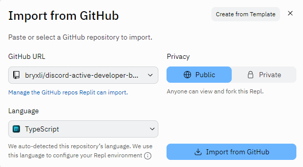
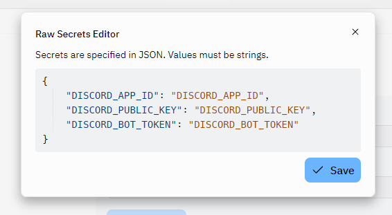

# Discord Active Developer Badge Bot

Simple Discord bot to get the Discord "Active Developer Badge" and maintain eligibility.

## Description

An in-depth paragraph about your project and overview of use.

## Getting Started

### Prerequisites

* Discord Application
* Replit account
* UptimeRobot account

### Instructions

1. Create a new Repl on [Replit](https://replit.com/)

    

2. Import the Repl code from GitHub

    

3. Enter `github.com/bryxli/discord-active-developer-badge` as GitHub URL

    

4. Click Import from GitHub

5. Replit will now ask for the command to run the bot, keeping the default of `npm run start` is okay.

    

6. Just to make sure everything was set up properly run `yarn`

    

7. Create a new secret using the Secrets tool

    

8. Enter secret information using [raw JSON](/secret.json)

    

9. Run the bot

    

10. Create a new monitor on [UptimeRobot](https://uptimerobot.com/dashboard?ref=website-header#mainDashboard)

    

    The URL can be found on Replit after running the bot in Webview

    

11. Claim the Active Developer Badge [here](https://discord.com/developers/active-developer). It can take up to 24 hours for the application to be considered active.

    