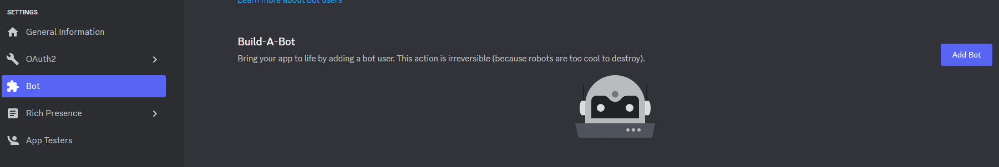
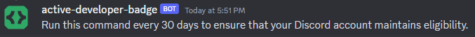
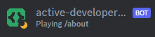

# Discord Active Developer Badge 

Simple Discord bot to get the Discord "Active Developer Badge" and maintain eligibility.


## Description

The Discord Active Developer Badge is a badge on your Discord profile recognizing you for being an active developer.

One condition to maintain this badge is that the bot must be interacted with at least once a month. This bot provides a fast and easy way to get the badge and keep the Discord bot running 24/7 to easily re-run the command every month.

There is no programming required to set this up. Simply create the bot and host it on Replit using the pre-written code in this repository.

## Getting Started

### Useful Links

* [Discord Application](https://discord.com/developers/applications)
* [Replit](https://replit.com/)
* [UptimeRobot](https://uptimerobot.com/dashboard?ref=website-header#mainDashboard)

### Discord

1. Create a new Discord Application.

    

2. Create a new Bot in Settings &rarr; Bot.

    

3. Generate Discord invite link through Settings &rarr; OAuth2 &rarr; URL Generator.

    

    The URL can be found on the bottom of the page under `Generated URL`. Invite the Discord bot to your **community** server. The server must be a community server to ensure that you get the active developer badge.

    The generated URL will be of the form `https://discord.com/api/oauth2/authorize?client_id={DISCORD_APP_ID}&permissions=0&scope=applications.commands%20bot`.

Write down the application ID, public key, and bot token. You will need these later when configuring on Replit.
```
{
    "DISCORD_APP_ID": "",
    "DISCORD_PUBLIC_KEY": "",
    "DISCORD_BOT_TOKEN": ""
}
```

### Replit

1. Create a new Repl on Replit.

    

2. Import the Repl code from GitHub.

    

3. Enter `github.com/bryxli/discord-active-developer-badge` as GitHub URL.

    

4. Click Import from GitHub.

5. Replit will now ask for the command to run the bot, keeping the default of `npm run start` is okay.

    

6. Just to make sure everything was set up properly run `yarn`.

    

7. Create a new secret using the Secrets tool.

    

8. Enter secret information using [raw JSON](/secret.json) with the secrets obtained earlier.

    

9. Run the bot.

    

    Note: It can take up to an hour for the command to become available.

### UptimeRobot

1. Find the Repl URL on Replit.

    

2. Create a new monitor on UptimeRobot.

    

## The Badge

### Interacting with the Bot

You should have already invited the bot to your **community** server from earlier. In a text channel, send the command `/about`. Make sure to send this command every month.



The bot status will automatically change depending on whether the command needs to be sent again. The bot will also remind you after 30 days.

 


### Claiming

Claim the Active Developer Badge [here](https://discord.com/developers/active-developer). It can take up to 24 hours for the application to be considered active.


